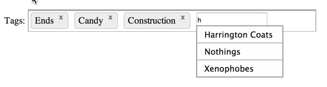

ember-autosuggest
=================


This Plug-In will auto-complete or auto-suggest completed search queries for you as you type.

There is very basic keyboard navigation using the up and down keys to scroll up and down the results and enter adds the selection,
while hitting escape hides the autocomplete menu.

This is a work in progress. 

## Usage
Declared in a template using the new [Ember component](http://emberjs.com/api/classes/Ember.Component.html) syntax.
```
{{auto-suggest source=controller destination=tags}}
```
- Specify a `source` binding that displays a list of selections to choose from.
- Specity  a `destination` binding that your selections will be bound to.

### Arguments
- `searchPath` - Specify the property for each object in the `source` list that will be used to auto suggest, the default is `name`.

```
{{auto-suggest source=controller destination=tags searchPath=make}}
```

- `minChars` - Specify how many characters the user must enter into the input before the search is triggered, the default is `1`.
```
{{auto-suggest source=controller destination=tags minChars=0}}
```

### Query an Ember-Data model
```
{{auto-suggest source=App.Employee destination=controller.dsChosenEmployees searchPath="fullName" minChars=0}}
```
This will call findQuery with an expression created from the **searchPath**.  In the above example, that would be:
```
store.find('employee', {fullName: '<query>'});
```
## Build It

1. `git clone https://github.com/dagda1/ember-autosuggest.git`
2. `bundle`
3. `bundle exec rake dist`
4. `cp dist/ember-autosuggest.js myapp/`
5. `cp examples/styles/autosuggest.css myapp/css`

## View the demo

Run ```bundle exec rackup``` and open [http://localhost:9292/examples/index.html](http://localhost:9292/examples/index.html) in a browser.

## Running unit tests

Run ```bundle exec rackup``` and open [http://localhost:9292](http://localhost:9292) in a browser.
